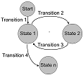

---
testspace:
---

# Startup 
This tests stages the application to be in state `idle`. All of the specific requirements can be found [here](https://github.com/newco/open-project/issues/27).

## Check Transitions
The the display based on the following configuratins: 

Mode 1.a | Mode 2.c
-------- | --------
 State 1 | State n

- Check for first transition after power up
- Check next step for **id=17.xx**. Should display url. 

Now review states based on following diagram:

## Power Scenario

## Switch On

## Turn off delay

## Full Idle Mode

## Exploratory
Capture observations based state transitions. Include screen shots with comments.

